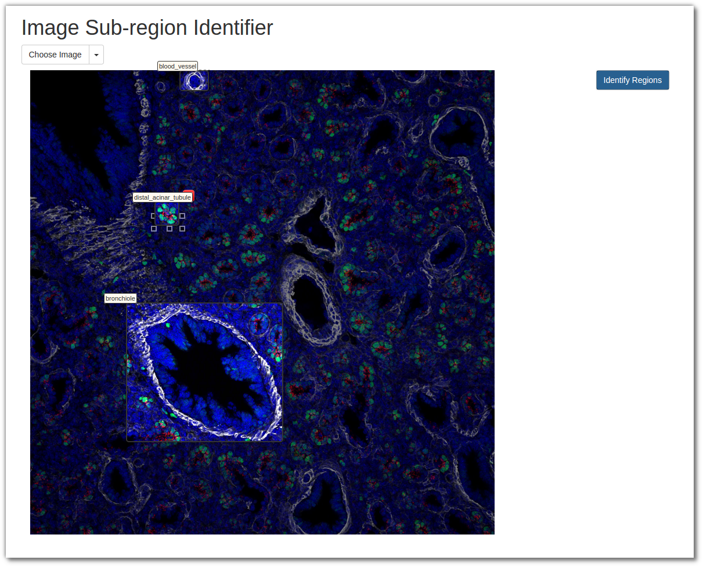

# wa-isit
Web Accessible Image Sub-region Identifier Tool



## Staning up with docker
```
docker build -t opencv_uwsgi .

docker run -d -p 5000:5000 -p 9191:9191 opencv_uwsgi
```   

## Live Demo
http://rapid-235.vm.duke.edu:5000
>>>>>>> upstream/master
