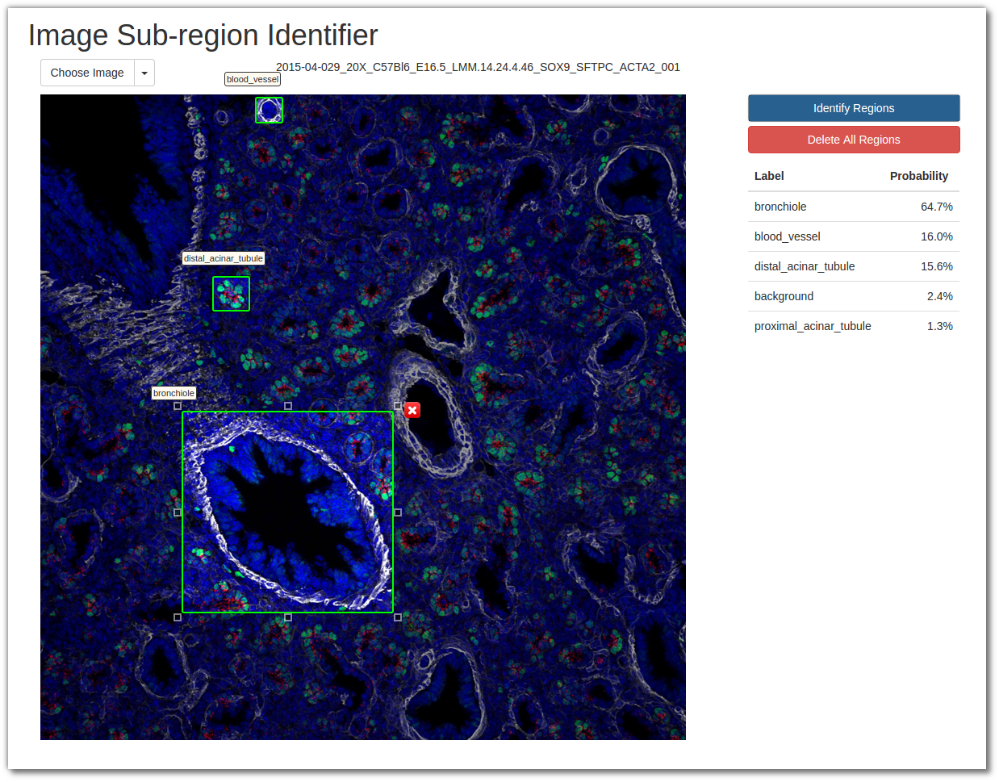

# wa-isit
Web Accessible Image Sub-region Identifier Tool



## Staning up with docker
```
docker build -t trainor .

docker run -d -p 5000:80 \
-v $(pwd):/trainor \
--name trainor \
--restart=always \
trainor /trainor/standup.sh
```   
